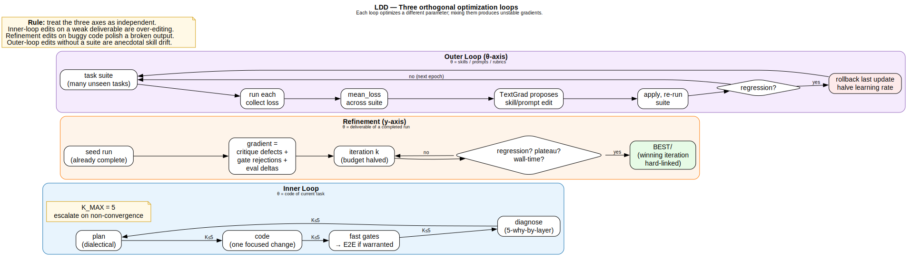
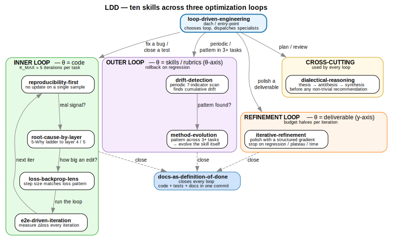
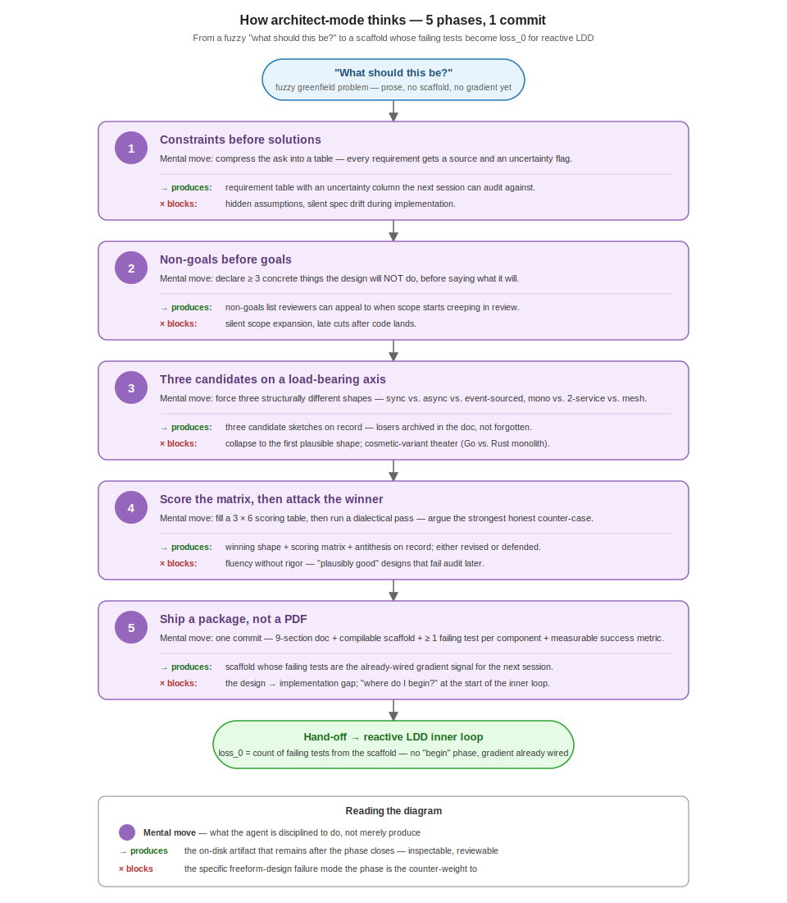

# Loss-Driven Development (LDD)

[](./LICENSE)
[](#installation)
[](./tests/README.md#current-measurements)
[](./skills/)

> **LDD is to AI-era coding what TDD was to human coding.**
> Ten portable skills (+ bootstrap entry-point) for any coding agent — **Claude Code · Codex · Gemini CLI · Aider · Cursor · Copilot CLI · Continue.dev** — that turn "the test is green, ship it" into a *measured* discipline where symptom patches, local-minimum traps, and silent code drift can't hide.

### Install in 30 seconds (Claude Code)

```bash
/plugin marketplace add https://github.com/veegee82/loss-driven-development.git
/plugin install loss-driven-development@loss-driven-development-dev
```

Then prefix any message with `LDD:` — the agent announces which skill it's invoking:

> *Invoking `root-cause-by-layer`*: symptom is a `TypeError`; walking the 5-layer ladder before the fix.

Full install for other agents (Codex · Gemini CLI · Aider · Cursor · …) below.

> 📦 **Where this came from:** distilled from [**AWP — Agent Workflow Protocol**](https://github.com/veegee82/agent-workflow-protocol) ([`pip install awp-agents`](https://pypi.org/project/awp-agents/)), an open standard for multi-agent orchestration where all three LDD loops — inner, refinement, outer — are implemented as live SGD code, not metaphor. See [**LDD in AWP**](./docs/ldd/in-awp.md) for the one-to-one mapping, a concrete debugging case study, and how to try the framework itself.

## Here's what an LDD session looks like

Every non-trivial LDD task emits a visible **trace block** inline — re-rendered after every iteration (v0.5.0+) so you watch the loss descend in real time, not a single summary at the end:

```
╭─ LDD trace ─────────────────────────────────────────╮
│ Task       : fix JSON parser bug across 3 functions
│ Loops      : inner → refine → outer  (all three fired)
│ Loss-type  : normalized [0,1]  (raw counts in parens)
│ Budget     : inner k=3/5 · refine k=2/3 · outer k=1/1
│
│ Trajectory : █▆▃▂··   0.500 → 0.375 → 0.125 → 0.100 → 0.000 → 0.000  ↓
│
│ Loss curve (auto-scaled, linear):
│   0.50 ┤ ●  ●
│   0.25 ┤       ●
│   0.00 ┤          ●  ●  ●
│        └─i1─i2─i3─r1─r2─o1→  iter
│        Phase prefixes: i=inner · r=refine · o=outer
│
│ Iteration i1 (inner, reactive)    loss=0.500  (4/8)
│   *reproducibility-first* + *root-cause-by-layer* → guard empty list, filter None values
│ Iteration i2 (inner, reactive)    loss=0.375  (3/8)   Δ −0.125 ↓
│   *e2e-driven-iteration* → isinstance-based filter for non-numeric types
│ Iteration i3 (inner, reactive)    loss=0.125  (1/8)   Δ −0.250 ↓
│   *loss-backprop-lens* → sibling-signature generalization check 3/3 green
│ Iteration r1 (refine)             loss=0.100  (1/10)  Δ −0.025 ↓
│   *iterative-refinement* → docstring sections + ValueError on all-invalid
│ Iteration r2 (refine)             loss=0.000  (0/10)  Δ −0.100 ↓
│   *iterative-refinement* → runtime invariants via assert
│ Iteration o1 (outer)              loss=0.000  (0/8)   Δ ±0.000 →
│   *method-evolution* → skill rubric updated; 3 sibling tasks no longer regress
│
│ Close:
│   Fix at layer: 4 (input-contract) · 5 (deterministic-before-LLM)
│   Docs synced : yes (SKILL.md + rubric updated)
│   Terminal    : complete
╰─────────────────────────────────────────────────────╯
```

Four parallel visualization channels encode the same SGD descent at different granularities:

- **Trajectory sparkline** (`▁▂▃▄▅▆▇█`) + net-direction trend arrow — micro-dynamics, 8-level resolution, separates a converged tail where losses differ by 0.05.
- **Mini ASCII chart** (`┤` axis + `●` markers) — macro-trajectory, tail convergence honestly collapses to the baseline row.
- **Per-iteration mode + info line** — the audit surface. `(inner, reactive)` / `Phase p1 (architect, inventive)` / `(refine)` / `(outer)` tells you which discipline was active; the indented `*<skill>* → <action>` line tells you what it did.
- **Per-step `Δ` + arrow** — local magnitude and direction of each step, distinct from the end-to-end sparkline arrow (a run can locally spike `↑` while ending net `↓`).

Full format spec in [`skills/using-ldd/SKILL.md`](./skills/using-ldd/SKILL.md) § Loss visualization. Persistence + slash commands in [§ Live trace below](#live-trace--see-the-loop-happen-in-real-time). Renderer + executed E2E demo: [`scripts/demo-trace-chart.py`](./scripts/demo-trace-chart.py) and [`scripts/demo-e2e-trace.py`](./scripts/demo-e2e-trace.py) — both runnable with zero deps.



## The one-sentence pitch

Every code change is an SGD step. Most agents optimize training loss (the visible test) and drive generalization loss (everything else) through the roof. **LDD installs a loss function, a gradient, a step-size rule, and a regularizer — so your agent's iteration converges instead of drifts.**

## Why you want this

| Without LDD | With LDD |
|---|---|
| Agent adds `try/except` around the failing line and ships | Agent walks 5 layers of causation and fixes at the boundary |
| "It was flaky, just retry" | One sample is noise; reproduce before gradient |
| Five 3-line patches in one function this morning | Step size mismatch detected; architectural edit proposed |
| "I'll update the docs later" | Code + tests + docs land in one commit, or the work isn't done |
| Same rubric violation across tasks; nobody notices | Outer-loop `method-evolution`: the skill itself is the bug |
| README describes a system that no longer exists | Periodic `drift-detection` scan finds it before onboarding does |

## The 10 reactive skills (+ architect-mode + `using-ldd` entry-point)



| Skill | Type | What it catches |
|---|---|---|
| **using-ldd** | entry-point | Bootstraps the bundle and dispatches the others via trigger-phrase table; fires on `LDD:` prefix or any trigger match |
| **loop-driven-engineering** | pattern (dach) | "Just start coding" without a plan or a budget |
| **reproducibility-first** | discipline | Updates on a single noisy sample |
| **root-cause-by-layer** | discipline | Symptom patches (try/except, shims, xfail, …) |
| **loss-backprop-lens** | pattern | Local-minimum traps, overfitting, wrong step size |
| **e2e-driven-iteration** | discipline | "I'll run the E2E at the end" — lost gradient |
| **dialectical-reasoning** | discipline | One-sided recommendations that skip the counter-case |
| **iterative-refinement** | pattern | Re-running from scratch when refinement is cheaper |
| **method-evolution** | pattern | Patching individual tasks when the method itself is the bug |
| **drift-detection** | pattern | Cumulative drift that no single commit introduced |
| **docs-as-definition-of-done** | discipline | "I'll update docs in a follow-up PR" |
| **architect-mode** *(opt-in, not default)* | discipline (5-phase) | Free-form "design doc" without constraint table, without non-goals, without 3-candidate comparison, without scoring, without failing-test scaffold. Greenfield design under discipline — **largest Δloss in the bundle (+10/10)**. Activate via `LDD[mode=architect]:` or `/ldd-architect` |

## The philosophy in 60 seconds

Engineering is **gradient descent on code**:

- A test / CI / E2E is a **forward pass**.
- The delta between expected and actual is the **loss**.
- Every edit is an **SGD step** — most are noise if you don't check them.
- A symptom patch is **overfitting**: low training loss, high generalization loss. Rejected even when CI is green.
- Docs are the **regularizer** — keep them in sync or generalization loss rises silently.
- Budget (`K_MAX=5`) prevents descending past local minima into drift.

Full mental model in [`docs/ldd/convergence.md`](./docs/ldd/convergence.md). The convergence conditions, the five divergence patterns, the drift taxonomy — all formally stated.

## Three loops, not one

Most "iterate on code" advice treats all edits the same. LDD separates three orthogonal optimization axes:

| Loop | You edit | When |
|---|---|---|
| **Inner** | The code | Every ordinary bug / feature / refactor |
| **Refinement** (y-axis) | The deliverable (doc, diff, design) | "Good enough, not great" — polish with a real gradient |
| **Outer** (θ-axis) | The skills / rubrics themselves | Same rubric violation across 3+ tasks |

Mixing them is the single biggest reason "iterate on the problem" never converges. LDD forces the question *which parameter am I changing*. Pictures in [`diagrams/`](./diagrams/).

## Installation

Skill content (`skills/*/SKILL.md`) is identical across platforms. Only the distribution format differs.

### Claude Code (primary target)

Two install paths depending on your Claude Code version:

**Option A — via the marketplace command** (works with any version that supports `/plugin marketplace add`):

```bash
# Inside a Claude Code session:
/plugin marketplace add https://github.com/veegee82/loss-driven-development.git

# Then install from the newly-registered marketplace:
/plugin install loss-driven-development@loss-driven-development-dev
```

Skills appear as `loss-driven-development:<name>` and trigger automatically when their `description` matches the current task. Explicit invocation: `/loss-driven-development:<skill-name>`.

**Option B — personal install, no plugin mechanism** (works in every Claude Code version):

```bash
# In your shell:
git clone https://github.com/veegee82/loss-driven-development.git
mkdir -p ~/.claude/skills
cp -r loss-driven-development/skills/* ~/.claude/skills/
```

Skills now appear in every Claude Code session, any project. No namespace prefix.

### Codex (OpenAI)

Codex reads `AGENTS.md` at the project root:

```bash
git clone https://github.com/veegee82/loss-driven-development.git
# Per-project install — copy AGENTS.md + skills/ into your project root:
cp -r loss-driven-development/AGENTS.md loss-driven-development/skills your-project/

# OR global install — if your Codex version supports a personal skills dir:
mkdir -p ~/.agents/skills
cp -r loss-driven-development/skills/* ~/.agents/skills/
```

### Gemini CLI

```bash
git clone https://github.com/veegee82/loss-driven-development.git
gemini extensions install ./loss-driven-development
```

`gemini-extension.json` registers the extension; `GEMINI.md` `@`-imports the twelve skills (the `using-ldd` entry-point first, followed by the ten reactive disciplines and `architect-mode`).

### Aider · Cursor · Copilot CLI · Continue.dev · generic

Read ambient instruction files (`.cursorrules`, `.github/copilot-instructions.md`, `CONVENTIONS.md`, project system prompts). Either reference the skills directory from your agent's instruction file, or copy the SKILL.md bodies inline. See [`AGENTS.md`](./AGENTS.md) for per-platform recipes.

## Methodology docs — `docs/ldd/`

LDD's methodology text lives in one canonical place: [`docs/ldd/`](./docs/ldd/). Each task type has its own ~1-page compressed reference; the agent loads only what the current task needs, not the whole methodology.

| File | When the agent loads it |
|---|---|
| [`docs/ldd/task-types.md`](./docs/ldd/task-types.md) | Always — the dispatch table |
| [`docs/ldd/getting-started.md`](./docs/ldd/getting-started.md) | First-time LDD user |
| [`docs/ldd/debugging.md`](./docs/ldd/debugging.md) | Bug / failing test / flaky run |
| [`docs/ldd/design-decisions.md`](./docs/ldd/design-decisions.md) | Design trade-off, architectural choice |
| [`docs/ldd/refactor.md`](./docs/ldd/refactor.md) | Structural change, step-size decision |
| [`docs/ldd/refinement.md`](./docs/ldd/refinement.md) | Deliverable polish (y-axis) |
| [`docs/ldd/release.md`](./docs/ldd/release.md) | Pre-commit / pre-release / pre-merge |
| [`docs/ldd/incident.md`](./docs/ldd/incident.md) | Production fire, fast-path |
| [`docs/ldd/method-maintenance.md`](./docs/ldd/method-maintenance.md) | Outer-loop: the skill itself isn't working |
| [`docs/ldd/convergence.md`](./docs/ldd/convergence.md) | Heavy reference — three loops, divergence patterns, drift taxonomy |
| [`docs/ldd/in-awp.md`](./docs/ldd/in-awp.md) | Case study — LDD in AWP |

This structure enforces single-source-of-truth for methodology text (no drift between skill bodies, README, and user docs). User-project `CLAUDE.md` / `AGENTS.md` should reference [`docs/ldd/task-types.md`](./docs/ldd/task-types.md) rather than copying methodology inline. See [`docs/ldd/README.md`](./docs/ldd/README.md) for integration notes.

## Using LDD — how to invoke the skills in a session

After install, Claude Code (and other agents) will auto-trigger LDD skills when your message matches a skill's `description`. But with many plugins installed, auto-trigger can be unreliable. Use the following patterns to guarantee activation.

### The `LDD:` buzzword — guaranteed activation

Prefix any message with `LDD:` to guarantee the bundle activates and the agent announces which skill it is invoking:

```text
LDD: the checkout test is failing and I need to ship in an hour
```

The agent will respond with something like:

> *Invoking `reproducibility-first`*: one failure is one sample; I'm checking reproducibility before treating this as a gradient. [checks] Confirmed reproducible — *Invoking `root-cause-by-layer`*: walking the 5-layer ladder before any fix.

Every skill invocation is announced in the `*Invoking <name>*:` format. If you don't see this line in a session where you prefixed `LDD:`, the bundle isn't active — re-check your install.

### Trigger phrases (what fires which skill)

These phrases in your messages reliably activate the named skill, even without the `LDD:` prefix:

| Your words | Skill that fires |
|---|---|
| "failing test", "CI is red", "flaky test", "one-off failure" | `reproducibility-first` |
| "bug", "error", "exception", "unexpected behavior" | `root-cause-by-layer` |
| "I've tried this 3 times", "keeps failing", 5 fix-commits in one area | `loss-backprop-lens` |
| "will this fix generalize", "sibling tests might break" | `loss-backprop-lens` |
| "is this the right approach", "should we ship X", design trade-off | `dialectical-reasoning` |
| "okay but not great", "polish this doc/diff/design" | `iterative-refinement` |
| "the skill itself might be wrong", "same pattern across tasks" | `method-evolution` |
| "is this codebase healthy", release-candidate review | `drift-detection` |
| "ready to commit", "declaring this done" | `docs-as-definition-of-done` |
| "let's work on this feature" / any multi-step task | `loop-driven-engineering` (dach) |

### Explicit invocation (Claude Code)

Call any skill directly by name:

```text
/loss-driven-development:root-cause-by-layer
```

Or ask for it in prose:

```text
Use root-cause-by-layer on this bug.
```

### Invocation on other agents

- **Codex** — reads `AGENTS.md`; add `LDD: ...` prefixes in the same way, agents supporting the AGENTS.md convention will pick up the rules there.
- **Gemini CLI** — `gemini-extension.json` registers the bundle; `@`-imports in `GEMINI.md` put the skills in context. Prefix messages with `LDD:`.
- **Aider · Cursor · Copilot CLI** — reference the skills from your agent's instruction file; the buzzword still works once the skills are loaded.

### Architect mode — Claude as designer, not just debugger (opt-in)

By default LDD is **reactive**: it debugs, refines, evolves. The methodology assumes code exists and loss signals come out of it. But what about the input-X-to-output-Y space *between* them — the architecture, decomposition, and structural decisions that have to exist before there's any code to debug?

For that, LDD has `architect-mode` — an **opt-in** skill that flips the loss target from "symptoms in existing code" to "quality of invented structure for a stated problem". When active, the agent runs a rigid 5-phase protocol:

1. **Constraint extraction** — every stated requirement into a table, uncertainties flagged explicitly
2. **Non-goals** — ≥ 3 concrete, scope-bounding declarations before any design work
3. **3 candidates** — exactly three on a *load-bearing axis*, not cosmetic variants
4. **Scoring + dialectic** — 3 × 6 matrix (requirements coverage / boundary clarity / evolution paths / dependency explicitness / test strategy / rollback plan) with dialectical pass on the winner
5. **Deliverable** — architecture doc + compilable scaffold + one failing test per component + measurable success metric per requirement, all in one commit

Activate for a single task:

```text
LDD[mode=architect]: design a billing service for 50M users with read-heavy workload

# or via slash command:
/loss-driven-development:ldd-architect

# or natural-language triggers: "design X", "architect Y", "greenfield", "from scratch"
```

After Phase 5 closes, architect-mode **hands off explicitly** to default LDD — the failing tests in the scaffold become `loss_0` for the regular inner loop, and you resume by saying "LDD: begin implementation".

**Why opt-in**: architect-mode is the right tool for greenfield design (5 % of tasks), overkill for the everyday bug-fix / refactor / incident flow (95 %). Leaving it default would force 5-phase ceremony on trivial work. Full rationale + the 10-item rubric it enforces: [`skills/architect-mode/SKILL.md`](./skills/architect-mode/SKILL.md) and [`docs/ldd/architect.md`](./docs/ldd/architect.md).

**Measured effect size**: largest in the bundle. Δloss = +10 / 10, 100 % of rubric items flipped between RED (base LLM produces plausibly-good but audit-failing design doc) and GREEN (all 5 phases completed, all 10 rubric items satisfied). Raw RED + GREEN + score in [`tests/fixtures/architect-mode/runs/20260420T190302Z-clean/`](./tests/fixtures/architect-mode/runs/20260420T190302Z-clean/).

#### Mental model — how architect-mode thinks

Architect-mode treats "what should this be?" as a **structured search under discipline**, not as a creative-writing prompt. Each of the five phases is a deliberate mental move that blocks a known failure mode of freeform LLM design work:



- **Phase 1 — compress the ask into constraints *before* imagining solutions.** Every requirement is pulled out of prose into a table with source and uncertainty column. The effect: solutions cannot silently drift off-spec later, because the spec is no longer prose — it is a checklist Phase 5 has to satisfy line by line. Hidden assumptions surface in the uncertainty column instead of living in the agent's head.
- **Phase 2 — declare what the design is *not* before saying what it is.** The ≥ 3 non-goals are scope-bounding commitments. They exist because every greenfield design silently expands until review; pre-committing to "this system will not do X / Y / Z" is cheaper than cutting X / Y / Z after the code lands.
- **Phase 3 — force three candidates on a *load-bearing* axis.** Cosmetic variants ("monolith in Go vs. monolith in Rust") are rejected; the three candidates must differ in a structural axis that will drive future change cost (sync vs. async vs. event-sourced; monolith vs. 2-service vs. mesh; pull vs. push vs. hybrid). This blocks the dominant failure mode of freeform design — collapsing to the first plausible shape without having considered the alternatives.
- **Phase 4 — score, then attack the winner.** A 3 × 6 matrix (requirements coverage / boundary clarity / evolution paths / dependency explicitness / test strategy / rollback plan) is filled in explicitly, then the winner is run through a dialectical pass: the strongest honest counter-case is argued against it and the design is either revised or defended on the record. This is the step that converts "plausibly good" into "survived its own antithesis".
- **Phase 5 — ship a package, not a PDF.** One commit: an architecture doc with 9 fixed sections, a scaffold of empty modules that imports cleanly, ≥ 1 failing test per component, and a measurable success metric per requirement. The failing tests become `loss_0` for the regular inner loop — architect-mode does not pretend to implement the system, it hands off to reactive LDD with the gradient signal already wired up.

**What you walk away with.** Five concrete artifacts on disk, not vibes:

1. A requirement table the next session can audit implementation progress against.
2. A non-goals list reviewers can appeal to when scope creeps.
3. Three alternative shapes on record — including the two that lost, so future "why didn't we do X?" questions have an answer older than institutional memory.
4. A scoring matrix plus the antithesis that was argued against the winner.
5. A compilable scaffold with failing tests — the inner loop can start reducing loss on day 1 without a "where do I begin?" phase.

**Benefits over freeform "design a thing" prompting.** The usual LLM output for "design X" is fluent prose that hides assumptions, commits to one shape, and leaves no hook for the next session. Architect-mode fixes each failure concretely: hidden assumptions die in Phase 1's uncertainty column; the one-shape default dies in Phase 3's load-bearing axis rule; fluency-over-rigor dies in Phase 4's dialectical attack on the winner; the hand-off gap dies in Phase 5's scaffold + failing tests. Measured outcome is in the eval fixture — 10/10 rubric items flip from violated to satisfied against the same base model (see the "Measured effect size" paragraph above).

**When this pays off.** The cost is real — five phases is heavier than "just design it" — so the payoff is shaped like the problem:

| Task shape | Architect-mode pays? |
|---|---|
| Greenfield service / new module with multiple components | **Yes** — largest Δloss in the bundle |
| Cross-layer structural decision ("how should we split this?") | **Yes** — the candidate + scoring phases are the whole point |
| Bug fix, small refactor, known-solution single-file edit | **No** — reactive LDD is cheaper and correct |
| Reviewing an existing design doc | **No** — use `iterative-refinement` instead |

Activation (manual flag, slash command, trigger phrases, and the v0.4.0 auto-dispatch by which the agent can enter the mode itself when the task shape warrants it) is documented in [`docs/ldd/architect.md`](./docs/ldd/architect.md) § Activation and [`skills/architect-mode/SKILL.md`](./skills/architect-mode/SKILL.md).

#### Creativity — three loss functions, not a freedom dial

Architect mode supports three discrete creativity levels. Per LDD's neural-code-network framing, they are **three different loss functions**, not three amounts of freedom:

| Level | Loss function | When to pick |
|---|---|---|
| `conservative` | `L = rubric_violations + λ · novelty_penalty` | Enterprise / no-new-tech / near-zero risk tolerance. All 3 candidates must be battle-tested. Component novelty is penalized. Team-familiarity weighted 2× in scoring. |
| `standard` (default) | `L = rubric_violations` | 95 % of architect runs. Current 10-item rubric, 3 candidates on a load-bearing axis. |
| `inventive` | `L = rubric_violations_reduced + λ · prior_art_overlap_penalty` | Research / prototype. Novelty rewarded, prior-art overlap penalized — but explicit experiment-validation path + fallback-to-standard baseline required. Not production-ready by default. Requires per-task user acknowledgment. |

```text
LDD[mode=architect, creativity=conservative]: design the billing service — stack-only, no new tech
LDD[mode=architect, creativity=standard]:     design a billing service for 50M users
LDD[mode=architect, creativity=inventive]:    prototype a new consistency protocol for this use case
```

Or via slash command: `/loss-driven-development:ldd-architect conservative`.

**Hard rules** (keep the feature from becoming a moving-target-loss escape hatch):
- No integer levels. Three discrete named alternatives only — "dial up until creative" is exactly the anti-pattern LDD fights.
- No mid-task switching. Mixing loss functions mid-gradient is incoherent; restart the task if you need a different level.
- `inventive` cannot be set as project-level default in `.ldd/config.yaml`. Research-grade opt-in is per-task with explicit acknowledgment.

Full per-level spec (how Phase 3 candidates, Phase 4 scoring weights, Phase 5 deliverable constraints, and the rubric change per level) in [`skills/architect-mode/SKILL.md`](./skills/architect-mode/SKILL.md) § Creativity levels. ML-lens framing in [`docs/ldd/convergence.md`](./docs/ldd/convergence.md) § 7.

### Hyperparameters — four ways to tune

Four knobs are exposed, deliberately few. See [`docs/ldd/hyperparameters.md`](./docs/ldd/hyperparameters.md) for the rationale (and for the list of parameters we **don't** expose and why — moving-target-loss is the anti-pattern we're avoiding).

| Knob | Default | Values / Range | Controls |
|---|---|---|---|
| `k_max` | `5` | 1–20 | Inner-loop iteration budget |
| `reproduce_runs` | `2` | 0–10 | Additional reruns in `reproducibility-first` Branch A |
| `max_refinement_iterations` | `3` | 1–10 | Refinement y-axis hard cap |
| `mode` | `reactive` | `reactive` \| `architect` | Reactive debugging mode (default) vs. opt-in architect-mode for greenfield design |
| `creativity` *(architect-mode only)* | `standard` | `conservative` \| `standard` \| `inventive` | Which loss function architect-mode minimizes. Three discrete objectives, not a continuous dial. `inventive` requires per-task acknowledgment and cannot be set project-level. |

Three ways to set them, in precedence order (highest first):

**1. Inline per task** — flags in square brackets on the `LDD:` prefix:

```text
LDD[k=3]: quick exploratory fix
LDD[k=10, reproduce=4]: deep dive on this flaky test
LDD[max-refinement=1]: one polish pass on this doc, then ship
LDD[no-reproduce]: I've already confirmed reproducibility — go to root-cause
```

**2. Project config** — `.ldd/config.yaml` (git-committable, team-shared):

```yaml
inner:
  k_max: 5
  reproduce_runs: 2
refinement:
  max_iterations: 3
```

Starter template at [`docs/ldd/config.example.yaml`](./docs/ldd/config.example.yaml). Copy to `.ldd/config.yaml` in your project root; every key is optional (unset keys fall through to bundle defaults).

**3. Slash commands** — session-scoped overrides:

| Command | Action |
|---|---|
| `/loss-driven-development:ldd-config` | Show effective config with per-key source (bundle / file / session / inline) |
| `/loss-driven-development:ldd-set k_max=8` | Set a session override (non-persisted) |
| `/loss-driven-development:ldd-reset` | Clear all session overrides |

The agent echoes the active budget in every trace block header, so you never wonder "did my setting stick?".

### Live trace — see the loop happen in real time

Every non-trivial LDD task emits a **visible trace block** inline in the chat so you can audit what's running without reading the agent's mind. The block is re-emitted **after every iteration** (v0.5.0+) so you watch the loss descend in real time — not a single summary at the end of the task:

```
╭─ LDD trace ─────────────────────────────────────────╮
│ Task       : fix JSON parser bug across 3 functions
│ Loops      : inner → refine → outer  (all three fired)
│ Loss-type  : normalized [0,1]  (raw counts in parens)
│ Budget     : inner k=3/5 · refine k=2/3 · outer k=1/1
│
│ Trajectory : █▆▃▂··   0.500 → 0.375 → 0.125 → 0.100 → 0.000 → 0.000  ↓
│
│ Loss curve (auto-scaled, linear):
│   0.50 ┤ ●  ●
│   0.25 ┤       ●
│   0.00 ┤          ●  ●  ●
│        └─i1─i2─i3─r1─r2─o1→  iter
│        Phase prefixes: i=inner · r=refine · o=outer
│
│ Iteration i1 (inner, reactive)    loss=0.500  (4/8)
│   *reproducibility-first* + *root-cause-by-layer* → guard empty list, filter None values
│ Iteration i2 (inner, reactive)    loss=0.375  (3/8)   Δ −0.125 ↓
│   *e2e-driven-iteration* → isinstance-based filter for non-numeric types
│ Iteration i3 (inner, reactive)    loss=0.125  (1/8)   Δ −0.250 ↓
│   *loss-backprop-lens* → sibling-signature generalization check 3/3 green
│ Iteration r1 (refine)             loss=0.100  (1/10)  Δ −0.025 ↓
│   *iterative-refinement* → docstring sections + ValueError on all-invalid
│ Iteration r2 (refine)             loss=0.000  (0/10)  Δ −0.100 ↓
│   *iterative-refinement* → runtime invariants via assert
│ Iteration o1 (outer)              loss=0.000  (0/8)   Δ ±0.000 →
│   *method-evolution* → skill rubric updated; 3 sibling tasks no longer regress
│
│ Close:
│   Fix at layer: 4 (input-contract) · 5 (deterministic-before-LLM)
│   Docs synced : yes (SKILL.md + rubric updated)
│   Terminal    : complete
╰─────────────────────────────────────────────────────╯
```

#### Mental model — the four visible channels

The numeric `loss_k = …` line gives the *value*. Four parallel channels, introduced in v0.5.0, make the *trajectory* AND the *work done per iteration* auditable at a glance:

| Channel | When | What it shows |
|---|---|---|
| **Trajectory sparkline** (`▁▂▃▄▅▆▇█`) + trend arrow (`↓`/`↑`/`→`) | ≥ 2 iterations | Micro-dynamics — 8-level resolution, separates a converged tail where losses differ by 0.05. Auto-scaled to `max(loss_observed)`; zero renders as `·`. The arrow reflects the **first-vs-last** delta, not local direction — so a run that regresses in the middle but ends below its start still reads `↓` end-to-end. |
| **Mini ASCII chart** (`┤` axis + `●` markers) | ≥ 3 iterations | Macro-trajectory — y-axis auto-scaled to nearest `0.25`-step multiple, values snap to gridlines. Tail convergence honestly collapses to the baseline row. X-axis labels (`i1`, `r2`, `o1`) align to data columns; phase prefix encodes which loop the iteration belongs to. |
| **Per-iteration mode + info line** | every iteration | Audit surface — the iteration label carries a mode parenthetical (`(inner, reactive)`, `Phase p1 (architect, inventive)`, `(refine)`, `(outer)`) so the reader can tell which discipline was active per iteration, AND an indented continuation line with `*<skill-name>*` + a one-line description of the concrete change the iteration produced. The user can walk the skill's work step-by-step. |
| **Per-step Δ + arrow** | every iteration after the first | Local magnitude and direction of this step's change (`Δ −0.125 ↓`, `Δ +0.167 ↑`, `Δ ±0.000 →`). Distinct from the end-to-end trend arrow on the sparkline line — per-step captures local motion, sparkline captures net motion. |

The sparkline and chart MUST agree on the final `loss_k`. The deterministic rendering recipe (sparkline indexing, chart snap, trend-arrow band) is specified in [`skills/using-ldd/SKILL.md`](./skills/using-ldd/SKILL.md) § Loss visualization so renders are reproducible across agents and sessions.

**Measurement**: the v0.5.0 fixture at [`tests/fixtures/using-ldd-trace-visualization/`](./tests/fixtures/using-ldd-trace-visualization/) exercises three scenarios (monotonic inner loop, full three-loop run, non-monotonic regression-recovery). Captured at `deepseek/deepseek-chat-v3.1`, T=0.7, via OpenRouter. **Per-scenario Δloss: +2 / +4 / +4; bundle-normalized = 0.833** — RED never emits any of the four channels, GREEN consistently emits the mode+info line and sparkline, with the mini chart and trend arrow emitted on the longer scenarios. The non-monotonic scenario 3 validates that GREEN correctly applies the first-vs-last rule (`↓` end-to-end despite the local `↑` at i2).

In project directories, LDD also appends one line per skill invocation to `.ldd/trace.log`:

```
2026-04-20T17:32:10Z  inner  k=1  skill=reproducibility-first   verdict=deterministic    loss_0=1
2026-04-20T17:32:45Z  inner  k=1  skill=root-cause-by-layer     layer4=domain-boundary   loss_0=1
2026-04-20T17:33:22Z  inner  k=1  close                         terminal=complete        loss_1=0  Δloss=+1
```

You can `tail -f .ldd/trace.log` in a second terminal to watch the loop happen live, or grep it for post-hoc audit.

Three slash commands surface the trace on demand:

| Command | What it shows |
|---|---|
| `/loss-driven-development:ldd-trace` | Current task's trace block + last 5 entries from `.ldd/trace.log` |
| `/loss-driven-development:ldd-status` | One-paragraph: active loop / last skill / current loss / what's next |
| `/loss-driven-development:ldd-explain` | Why the last skill fired — with the user's trigger phrase quoted from the dispatch table |

### Verifying LDD is active

A session with LDD active shows at least one of:

- An `*Invoking <skill-name>*:` announcement before a non-trivial edit or recommendation
- A commit message that names structural origins, layers, or Δloss
- Explicit thesis / antithesis / synthesis sections in design replies
- Refusal of a symptom-patch under pressure with a named rule (e.g. "Red Flag — tolerance shim")

If you see none of these in an interaction where you expected them, LDD is installed but dormant. Either prefix `LDD:`, name the skill explicitly, or re-check the install (see [`GAPS.md`](./GAPS.md) §Distribution gaps).

## Optional Claude-Code tooling

`scripts/` contains seven optional helpers (not required, not part of the skills):

- `scripts/drift-scan.py` — runs the seven drift indicators over a repo, produces a Markdown report
- `scripts/capture-clean-baseline.py` — captures RED/GREEN baselines via direct LLM API (no agent harness) for any fixture
- `scripts/capture-red-green.py` — paired RED/GREEN captures for multi-scenario fixtures (skill content prepended as system-message on GREEN)
- `scripts/evolve-skill.sh` — scaffolds a RED/GREEN re-run for a skill against its fixture (terminal-driven)
- `scripts/render-diagrams.sh` — regenerates SVGs from the `.dot` sources
- `scripts/demo-trace-chart.py` — renders the v0.5.0 trace block (sparkline / mini chart / mode+info / trend arrow) from a hard-coded 6-iteration task. Pure renderer, no LLM calls.
- `scripts/demo-e2e-trace.py` — executed E2E demo: optimizes a real `compute_average()` through all three loops, running actual rubric checks against actual compiled code and re-rendering the trace after each iteration.

Run them manually, wire them into CI, or ignore them. The skills don't depend on them.

Also ships: [`commands/`](./commands/) — seven Claude-Code slash commands (`/loss-driven-development:ldd-trace`, `ldd-status`, `ldd-explain`, `ldd-config`, `ldd-set`, `ldd-reset`, `ldd-architect`) for trace inspection, session-level hyperparameter overrides, and architect-mode activation. See the "Using LDD" and "Architect mode" sections above.

## Relation to `superpowers`

Complementary, not a replacement, for [`obra/superpowers`](https://github.com/obra/superpowers):

- `superpowers:brainstorming` / `writing-plans` / `test-driven-development` / `verification-before-completion` — process skills. `loop-driven-engineering` dispatches to these when available.
- `superpowers:systematic-debugging` overlaps with `root-cause-by-layer`: prefer `root-cause-by-layer` for the explicit 5-layer ladder, `systematic-debugging` for the broader "where do I start looking" framing.

Install both.

## How the skills were built (TDD-for-skills)

Each skill was developed via **RED → GREEN → REFACTOR**:

1. **RED** — pressure scenario run against a fresh subagent with no skill loaded. Baseline rationalizations captured verbatim.
2. **GREEN** — skill written to address those specific rationalizations; scenario re-run with the skill loaded to verify compliance.
3. **REFACTOR** — new rationalizations surfacing in the GREEN run fold back into the skill's Red Flags and Rationalizations tables.

Formal loss function, per-skill rubrics, and E2E definition in [`evaluation.md`](./evaluation.md). Reproducible pressure scenarios in [`tests/fixtures/`](./tests/fixtures/). An integration scenario starter in [`tests/e2e/scenario-01-refactor/`](./tests/e2e/scenario-01-refactor/).

## What's verified, what isn't

Honest accounting in [`GAPS.md`](./GAPS.md).

**Measured (2026-04-20, v0.3.2 — normalized form):**

- All 11 skills have clean RED/GREEN runs with artifacts on disk; plus a 6/6-green E2E suite at [`tests/e2e/v031-runs/`](./tests/e2e/v031-runs/).
- **`Δloss_bundle = 0.561` normalized** (mean fraction of rubric violations each skill removes) — target `≥ 0.30` **met with margin**. Per-skill normalized Δloss ranges 0.250 → 1.000. All GREEN runs score 0 violations. Per-skill numbers + raw `(N/max violations)` counts + inter-reviewer variance in [`tests/README.md`](./tests/README.md#current-measurements).
- **Tier-3.5 simulated E2E captured:** an agent with tool access closed the `scenario-01-refactor` loop at iteration 1/5 with 7/7 rubric items satisfied. Fix diff + commit + summary in [`tests/e2e/scenario-01-refactor/runs/20260420T160347Z/`](./tests/e2e/scenario-01-refactor/runs/20260420T160347Z/).
- **User-facing invocation documented:** `LDD:` buzzword for guaranteed activation + trigger-phrase table per skill + per-agent install guide. See the "Using LDD" section above.

**Still pending:**

- **Real tier-4** (live `/plugin install` + multi-step run) — that's the gate you close as an early adopter. The simulated tier-3.5 is close but not identical.
- 1 skill (`docs-as-definition-of-done`) cannot be RED-tested from any session with an ambient doc-sync rule — needs an adopter running the fixture in a genuinely empty environment.
- Single-run point estimates, not distributions (N=1 per skill).
- Author-scored; 2 of 9 fixtures have independent-judge sampling (±2 magnitude variance, 100 % direction agreement).
- Word counts exceed `<500`-per-skill guidance; discipline-heavy skills are denser.

Treat this as **v0.2 measured seed**. If a skill doesn't change your agent's behavior on a real pressure case, open an issue using the [`.github/ISSUE_TEMPLATE/skill-failure.md`](./.github/ISSUE_TEMPLATE/skill-failure.md) template — that's the baseline data that moves us from v0.2 measured to v0.3 generalized.

## License

MIT — see [LICENSE](./LICENSE).

## Author

Silvio Jurk — `silvio.jurk@googlemail.com` · [github.com/veegee82](https://github.com/veegee82)

## The bigger picture — AWP

LDD is the portable, platform-agnostic **discipline**. [**AWP — Agent Workflow Protocol**](https://github.com/veegee82/agent-workflow-protocol) is the full **runtime** this discipline came from — an open standard for multi-agent orchestration with two execution engines (DAG + delegation-loop), 36 normative rules, and **all three LDD loops implemented as live SGD code**:

- **Inner loop** → AWP's budget-bounded work loop (`K_MAX = 5`, test pyramid, escalation)
- **Refinement loop** → AWP's `awp refine <seed_run_dir>` — y-axis SGD on deliverables with critique-derived gradients
- **Outer loop** → AWP's `awp optimize --with-textgrad` — θ-axis SGD on prompt artifacts with TextGrad as LLM-as-optimizer, rollback on regression

If LDD as discipline makes sense to you, AWP is what it looks like when the whole framework is built around it. Read [**LDD in AWP**](./docs/ldd/in-awp.md) for the one-to-one concept mapping, a concrete debugging case study, and install instructions.

```bash
pip install awp-agents && python -m awp studio
```

⭐ Star [`veegee82/agent-workflow-protocol`](https://github.com/veegee82/agent-workflow-protocol) if LDD helped you — that's where the methodology is being pushed forward.
