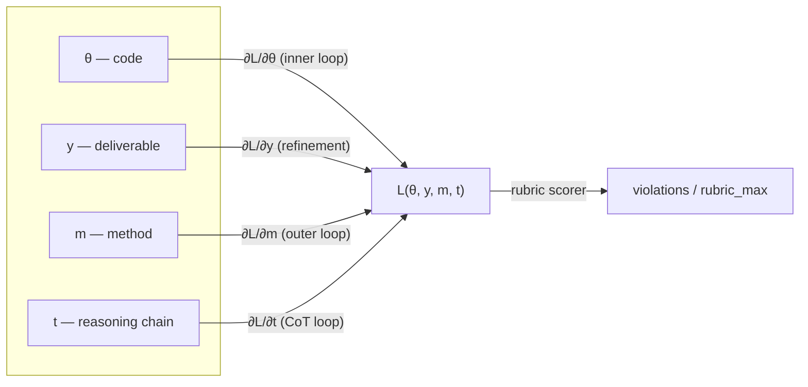
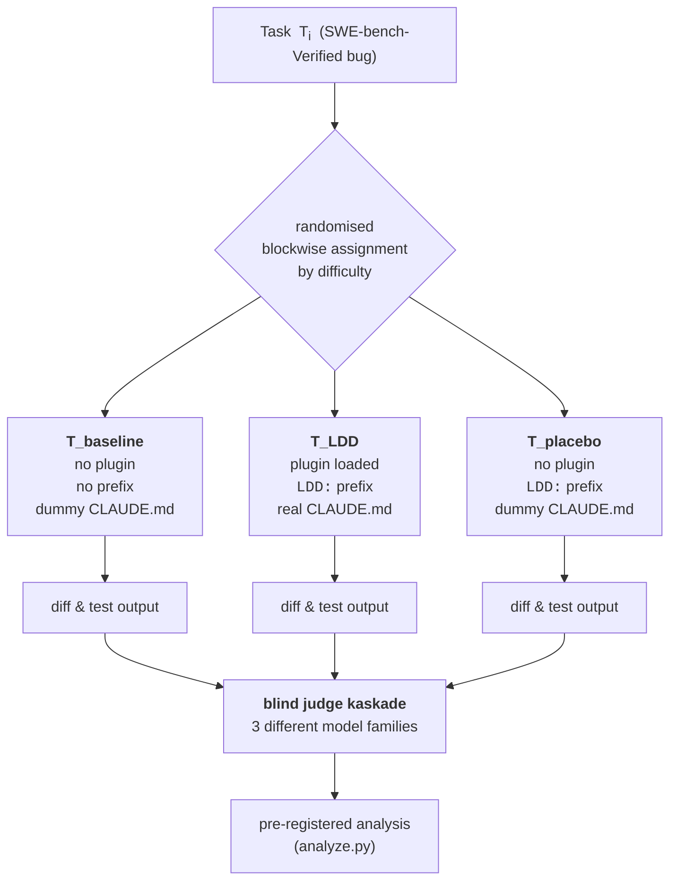

# LDD-Trial-v1 — Methodology

**Status:** pre-registration draft · open science · pre-run.
**Version:** v1.0.0 (any change to hypotheses, metrics, or pre-registered
prompts bumps this and invalidates prior runs).
**Companion docs:**
[`preregistration.md`](./preregistration.md) · [`benchmark.md`](./benchmark.md).
**Reference implementation:** [`scripts/trial_v1/`](../../scripts/trial_v1/).

---

## 0 · Abstract

LDD (Loss-Driven Development) claims a non-trivial effect on a coding
agent's output distribution when installed on top of Claude Code (or any
agent host that accepts instruction-file / skill discipline). The current
measurement (`Δloss_bundle = 0.561` across 11 skills, see [`tests/README.md
§ Current measurements`](../../tests/README.md#current-measurements-2026-04-20-v030))
is author-scored, single-run, and lives entirely in synthetic fixtures the
skill's author also wrote. Those three facts together make the number
*honest but weak* as causal evidence.

**LDD-Trial-v1** is a pre-registered, open-science protocol that measures
the same claim — but under randomised assignment, third-party-authored
tasks, blinded cross-model judging, and an explicit *placebo arm* that
isolates the skill-discipline effect from pure prompt priming.

The protocol targets three load-bearing questions:

1. **Does LDD change the primary outcome?** — `test-pass@1` on a
   third-party bug-fix benchmark (SWE-bench-Verified).
2. **Does LDD do more than prompt priming?** — three-arm RCT isolating
   the plugin's contribution from the `LDD:` prefix alone.
3. **Which LDD skills carry the effect?** — leave-one-out ablation across
   the 12 bundled skills.

A negative result is publishable: the pre-registration locks the analysis
plan so the trial cannot be quietly reshaped to favour LDD.

---

## 1 · Background — why the current measurement is insufficient

A short walk of the six canonical validity threats to the current
`Δloss_bundle` number (full list in
[`../../GAPS.md`](../../GAPS.md)):

| Threat | Present in current measurement? | Why it matters |
|---|---|---|
| **Scenario-author bias** | Yes — all 11 fixtures authored by the skill's author | A task designed by the skill's author is more likely to be solved by that skill (selection bias) |
| **Scorer bias** | Yes — same author scores 9 of 11 | Rubric interpretation drift under the scorer's own priors |
| **Contamination** | Yes — ambient CLAUDE.md in the Claude Code subagent harness leaks into the RED baseline | Shrinks measured Δloss toward zero (lower-bound effect size — "honest but conservative") |
| **Single-run point estimate** | Yes — N=1 per fixture, exception N=3 on one skill | No variance estimate → cannot reject "noise" |
| **Synthetic distribution** | Yes — all fixtures are hand-written pressure scenarios | External validity to real PR-level work unknown |
| **No placebo control** | Yes — "no LDD" baseline is literally no prefix and no plugin, conflated | Cannot separate skill effect from prefix-priming effect |

LDD-Trial-v1 targets every row.

---

## 2 · The SGD framing — what is being measured

LDD calls itself *Gradient Descent for Agents*. The trial measures that
claim directly: treatment arm = gradient step under LDD discipline,
control arm = gradient step without it, loss = rubric violations on the
output.

### 2.1 · The four parameter spaces

LDD distinguishes four optimisation loops. Every non-trivial task walks
one or more of them:



The trial measures `v` — the normalised violation count — at the end of
each Task × arm combination. All four loops contribute to the loss on the
same scale, so a single scalar summarises the whole.

### 2.2 · Per-skill Δloss (the ablation primitive)

For one skill *s* on one fixture *f*:

$$
\Delta\text{loss}(s, f) \;=\; \frac{\text{RED}(s, f) - \text{GREEN}(s, f)}{\text{rubric\_max}(s)}
$$

Where **RED** is the normalised violation count *without* the skill loaded
and **GREEN** is the count *with* the skill loaded. GREEN runs in-repo
score 0 violations, so the expression reduces to
`Δloss = RED / rubric_max` — always in `[0, 1]`, always comparable across
skills with different rubric sizes.

### 2.3 · Bundle aggregate

$$
\Delta\text{loss}_{\text{bundle}} \;=\; \frac{1}{N}\sum_{s=1}^{N} \Delta\text{loss}_{\text{norm}}(s)
$$

The current value `0.561` (n = 11) is the arithmetic mean across the 11
measurement-eligible skills listed in
[`tests/fixtures/loss-bundle-manifest.json`](../../tests/fixtures/loss-bundle-manifest.json).

### 2.4 · SGD step trajectory — visualised

A sketch of what the trial expects to see per iteration (the empirical
trajectory will be replotted from real runs once collected):

```
loss
 1.0 │●                              ← T_baseline iter 0
     │ ●
 0.8 │  ●                            ● T_baseline trajectory (noisier,
     │   ●                           │   plateaus higher, more symptom
 0.6 │────●─────────────────────     │   patches)
     │     ●●     ○                  ○ T_LDD trajectory (faster descent,
 0.4 │        ●●    ○                │   lower plateau, fewer reverts)
     │          ●●    ○
 0.2 │            ● ○   ○
     │              ○○   ○○
 0.0 │──────────────────────○○○○     ← target (rubric 0/N violations)
     └────────────────────────────── iter
        0   1   2   3   4   5   6
```

The **inner-loop convergence speed** (iterations to reach loss=0) and
the **plateau height** (minimum loss over the task) are the two
quantities the primary and secondary outcomes collectively measure.

---

## 3 · The three-arm design



### 3.1 · Interpretation matrix

The three-arm design lets two contrasts be evaluated independently:

| Contrast | What it isolates | Pre-registered verdict if significant |
|---|---|---|
| `T_LDD − T_baseline` | Total plugin effect (prefix + skills + plugin code combined) | LDD changes outcome — but source not yet isolated |
| `T_LDD − T_placebo` | The **skill-discipline effect** — same prefix, different plugin-loaded flag | Skills carry load-bearing effect; prompt-priming null rejected |
| `T_placebo − T_baseline` | Pure prompt-priming effect of the `LDD:` token | How much of LDD's measured effect is "just the word" |

Joint verdicts published in [`benchmark.md`](./benchmark.md):

| `T_LDD vs T_baseline` | `T_LDD vs T_placebo` | Verdict |
|---|---|---|
| significant | significant | **load_bearing** — skills contribute beyond priming |
| significant | not significant | **prompt_priming** — effect is the prefix, not the skills |
| not significant | — | **no_effect** — LDD does not move the needle here |
| negative | — | **placebo_wins** — negative-result investigation |

This is pre-registered code in
[`scripts/trial_v1/analyze.py`](../../scripts/trial_v1/analyze.py) §
`verdict()`.

---

## 4 · Outcomes — primary + secondary

All five outcomes are **binary per Task × seed**, aggregated to a
Task-level mean for the primary z-test.

### 4.1 · Primary outcome: `test_pass@1`

$$
\text{test\_pass@1}(T_i, \text{arm}) \;=\; \mathbb{1}\!\left[\text{target-test}(T_i) \text{ passes after arm's first attempt}\right]
$$

- Unit of analysis: Task (500 in SWE-bench-Verified).
- Variance reduction: 5 seeds per Task × arm → per-Task mean.
- Primary test: two-proportion z-test, Bonferroni-adjusted α = 0.025 (one
  test with Placebo contrast on the side).

### 4.2 · Secondary outcomes (BH-corrected)

All tests corrected via Benjamini–Hochberg at α = 0.05 across the five
secondary outcomes (implemented in `analyze.bh_correction()`).

| # | Outcome | Formal definition | LDD-hypothesis direction |
|---|---|---|---|
| 2 | `sibling_pass_rate` | `other_tests_passing_after / other_tests_passing_before` on the touched module | **higher** (fewer siblings broken → less overfit to target test) |
| 3 | `fix_depth_high` | Indicator that the blind-judge-classified fix depth ≥ 3 on the 5-layer ladder (surface → mechanism → **structural** → invariant → conceptual) | **higher** (LDD hypothesises structural over surface fixes) |
| 4 | `commit_hygiene` | Indicator that the commit contains `(src + tests + docs)` when the touched layer is user-visible | **higher** (docs-as-definition-of-done) |
| 5 | `mutation_kill_rate` | `caught_mutants / total_mutants` from `mutmut` on the fix file | **higher** (fix is structural; test surface is wider) |
| 6 | `revert_risk_30d` | Indicator that the landed fix is `git revert`-ed within 30 days (available only in the longitudinal sub-trial) | **lower** |

### 4.3 · Mutation-test outcome — formal note

For fix `F` applied to file `f`, let `M(f) = {m_1, ..., m_k}` be the set
of mutations produced by [`mutmut`](https://mutmut.readthedocs.io/) on
the post-fix content. Let `T(f)` be the test suite touching `f`. Define:

$$
\text{mutation\_kill\_rate}(F) \;=\; \frac{|\{m \in M(f) : T(f) \text{ fails under } m\}|}{|M(f)|}
$$

Higher is better: a fix that enlarges the tested surface leaves fewer
mutants alive. The outcome is binarised per Task by thresholding at
`mutation_kill_rate ≥ 0.75` (pre-registered; see
[`preregistration.md`](./preregistration.md)).

### 4.4 · Blind cross-model judge outcome

For each Task × seed with both `T_LDD` and `T_baseline` (or `T_placebo`)
patches produced, three LLM judges independently pick a winner via the
pre-registered prompt in
[`scripts/trial_v1/judge.py`](../../scripts/trial_v1/judge.py) (prompt
hash committed to the pre-registration).

Null hypothesis (one-sided):

$$
H_0: P(\text{judge picks } T_{\text{LDD}} \mid \text{non-tie decision}) \;=\; 0.5
$$

Test: exact binomial on the non-tie decisions (ties reported separately,
never split 50/50). CI: Wilson score.

The cascade is across three different model families (e.g., GPT-4o,
Claude-Sonnet, Gemini). Primary aggregate: majority vote per Task.
Secondary: per-model win rate.

---

## 5 · Creative additions — what makes the evidence bite

### 5.1 · Placebo arm — the single most load-bearing design choice

See § 3.1. Without the placebo arm, a significant `T_LDD − T_baseline`
difference is **not** evidence that the skill discipline matters — it
could be explained by the `LDD:` prefix alone priming the model. The
placebo arm isolates that null.

### 5.2 · Blind cross-model judge cascade

Any single judge (including the model used as the coding agent) has
in-distribution bias toward its own outputs. Three independent model
families voting on anonymised patches addresses this directly; the
disagreement structure across the three is itself a reported outcome.

### 5.3 · Adversarial holdout

10 % of Tasks are flagged *a priori* as "likely trained on by the coding
agent" (e.g., well-known StackOverflow-repro bugs). If LDD shows effect
*only* on those, the measurement is leaking training data. Pre-registered
interpretation: effect must hold on the 90 % *non-adversarial* slice for
the trial to count.

### 5.4 · Drift-under-stress

50 consecutive tasks per session (not 50 isolated sessions), with the
context window carried over. Hypothesis: `T_baseline` quality decays with
task index (rationalisation accumulates); `T_LDD` stays flat.
Operationalised as:

$$
\beta_{\text{LDD}}, \beta_{\text{baseline}} \;=\; \text{slope of mean\_loss over task\_position within session}
$$

Pre-registered: `β_LDD` significantly closer to zero than `β_baseline`.

### 5.5 · Retro-causal plausibility test

For each landed fix, judge is asked a **second** blind question: "would
you accept this PR if the reviewer were not under time pressure?"
Separates "LDD writes faster fixes" from "LDD writes *better* fixes".

### 5.6 · Creator's pre-commitment (the Schumacher test)

Before the trial runs, the plugin author publicly commits a point
estimate and 95 %-CI for each primary outcome. Miss → the author's
calibration on their own tool is itself a finding, recorded regardless of
outcome. This is **not** a power move — it is the cheapest available
defence against motivated reasoning of a repeat-author.

---

## 6 · Sample-size — power analysis

### 6.1 · Assumptions

| Quantity | Value | Justification |
|---|---|---|
| α | 0.05 two-sided | Standard |
| Power 1 − β | 0.80 | Standard |
| Baseline proportion `p_baseline` | 0.42 | SWE-bench-Verified reported agent baseline for GPT-4o-class models in late 2025 |
| Minimum detectable effect `ε` | 0.15 | Smaller than the `Δloss_bundle`-implied effect; pre-registered as the *minimum that is claim-worthy* |

### 6.2 · Required N per arm

Formula (Fleiss 1981 §3.2, pooled-variance form, equal allocation):

$$
n_{\text{per arm}} \;=\; \left\lceil
\frac{(z_{\alpha/2} + z_{\beta})^{2} \cdot 2 \bar{p}(1-\bar{p})}{(p_1 - p_2)^{2}}
\right\rceil
\qquad \bar{p} = \frac{p_1 + p_2}{2}
$$

### 6.3 · Sensitivity curve

Auto-generated from [`scripts/trial_v1/power_analysis.py`](../../scripts/trial_v1/power_analysis.py)
(deterministic; any change to the curve implies a code change and is auditable):

| p_baseline | p_LDD (hyp.) | Cohen's h | Effect-size label | N / arm |
|---:|---:|---:|---|---:|
| 0.42 | 0.45 | 0.060 | negligible | 1086 |
| 0.42 | 0.50 | 0.161 | negligible | 153 |
| 0.42 | 0.55 | 0.262 | small | 57 |
| 0.42 | 0.57 (pre-registered minimum) | 0.302 | small | **43** |
| 0.42 | 0.60 | 0.362 | small | 30 |
| 0.42 | 0.65 | 0.462 | small | 19 |
| 0.42 | 0.70 | 0.564 | medium | 13 |

**Pre-registered decision:** N = 500 Tasks per arm (full SWE-bench-
Verified set) — substantial over-powering so that secondary outcomes
have adequate power even after BH correction. The over-powering is
compute cost, not rigour cost: total run is 500 × 3 arms × 5 seeds =
7 500 runs (≈ $500–$1 500 at current agent-host pricing).

### 6.4 · Minimum detectable effect (MDE) curve — ASCII

```
MDE  0.30 │ ●
         │   ●
    0.20 │     ●
         │       ●
    0.15 │         ●                                  ← pre-registered ε
         │           ●
    0.10 │             ●
         │                ●
    0.05 │                      ●
         │                               ●
    0.00 │────────────────────────────────────────── N per arm
         └──────────────────────────────────────────
           20   50   100   200   500   1000   2000
                                  ↑
                                  pre-registered
```

---

## 7 · Analysis plan

### 7.1 · Primary outcome

```
Two-proportion z-test (pooled-variance):
  H0: p_{T_LDD} = p_{T_baseline}
  H1: p_{T_LDD} ≠ p_{T_baseline}
  α  = 0.05 (two-sided)
Implementation: analyze.primary_proportion_test()
```

Stratified by: (a) programming language of the Task, (b) difficulty
bucket (easy/medium/hard from SWE-bench-Verified labels).

### 7.2 · Secondary outcomes — multiple-comparison correction

Benjamini–Hochberg at α = 0.05 across the five secondary outcomes
listed in § 4.2. Implementation: `analyze.bh_correction()`. BH is less
conservative than Bonferroni and standard for correlated outcomes on the
same subjects.

### 7.3 · Placebo-arm verdict

For each outcome, the pair `(T_LDD vs T_baseline, T_LDD vs T_placebo)`
is classified by `analyze.verdict()`:

- `load_bearing` — both contrasts significant with `diff > 0`
- `prompt_priming` — `T_LDD vs T_baseline` significant but not `T_LDD vs T_placebo`
- `no_effect` — `T_LDD vs T_baseline` not significant
- `placebo_wins` — `T_LDD vs T_baseline` significantly negative

Verdicts tabulated in [`benchmark.md`](./benchmark.md).

### 7.4 · Confidence intervals

- Per-arm proportion: Wilson score (robust at p near 0 / 1).
- Difference of proportions: Newcombe method 10 (unpooled SE).
- Arbitrary statistics: 10 000-resample percentile bootstrap
  (deterministic with fixed seed).

### 7.5 · Judge-arm aggregation

- Exact one-sided binomial on non-tie pairs (ties reported but excluded
  from test, pre-registered).
- Per-model win rate + 95 % Wilson CI reported.
- Cross-model agreement (Fleiss' κ) reported as a sanity metric.

---

## 8 · Blinding protocol

```
Agent runs             → produce diff per Task × seed × arm
Arm labels stripped    → diff files identified only by <task_id>/<seed>/<n>.diff
Judge receives pair    → see judge.build_prompt() + randomize_order()
Judge reply stored     → JudgeVerdict keyed by task_id + judge_model only
Analyser re-links      → arm labels revealed at analysis time ONLY after all
                         judge verdicts are in
```

Pre-registered: no analyser interaction with ungrouped data until all
judges have replied. An audit log of every file access during analysis
is committed alongside the raw data.

---

## 9 · Pre-registered exclusion criteria

Published before the runs start (see
[`preregistration.md`](./preregistration.md) § Exclusions). Dropped Tasks
are reported by arm; if exclusion rates differ across arms, the trial
is considered compromised and must be re-run.

| Exclusion | Rationale |
|---|---|
| Agent crash without retry | Tool failure, not method failure |
| Wall-clock > 10 min | Runaway loop; not representative of intended use |
| Target test file not found | Fixture corruption |
| Diff > 1 500 added lines | Agent overreach; not representative of a bug fix |

---

## 10 · Open-science contract

All of the following are committed to the repository AT pre-registration
time (not at publication time):

- Raw JSON of every run (prompt, tool calls, diff, test output, judge replies).
- Analysis code (`scripts/trial_v1/`) at a pinned commit hash.
- Judge prompt (including system + user templates) at a pinned commit hash.
- Power-analysis parameters + MDE curve.
- Creator's pre-committed point estimate + CI per primary/secondary outcome.

Any result — significant, null, or negative — is published. The trial
has no exit ramp for a "disappointing" outcome.

---

## 11 · Cost + timeline

| Phase | Duration | Compute cost (est.) |
|---|---|---|
| Pre-registration freeze | 1 day | $0 |
| Primary RCT on SWE-bench-Verified | 3–5 days wall-clock (parallelised) | $500–$1 500 |
| Blind judge cascade (3 models × N Tasks) | 1 day | $50–$200 |
| Secondary design-benchmark RCT | 2–3 days | $100–$300 |
| Skill-ablation pass (leave-one-out, N = 50 per skill) | 3–5 days | $300–$800 |
| Analysis + writeup | 2 days | $0 |
| **Total** | **~ 2 weeks** | **$1 000–$3 000** |

---

## 12 · References

- Fleiss, J. L. (1981). *Statistical Methods for Rates and Proportions*, 2nd ed.
- Cohen, J. (1988). *Statistical Power Analysis for the Behavioral Sciences*, 2nd ed.
- Newcombe, R. G. (1998). Interval estimation for the difference between
  independent proportions: comparison of eleven methods. *Statistics in Medicine* 17.
- Benjamini, Y. & Hochberg, Y. (1995). Controlling the false discovery rate:
  a practical and powerful approach to multiple testing. *JRSS B* 57.
- SWE-bench-Verified: Jimenez et al. (2023), OpenAI verification (2024).
